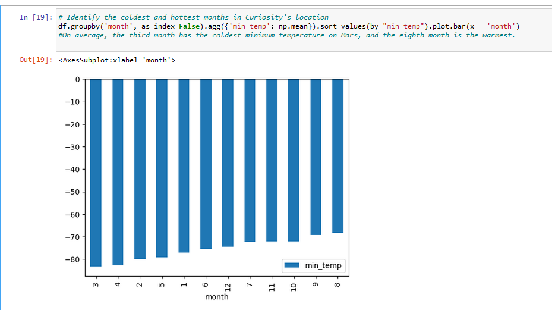

# Mission-to-Mars

# Overview of Project

In this class module, we were introduced to web scraping and tasked with helping Robin, a data analyst at an aerospace company called SpaceForward.  The goal was to scrape information about Mars' climate and missions.  Once the information was collected, it was then organized into a database.  Although one website was used for this project, web scraping can be used to collect and organize web data from various sources into a usable database.  

When it comes to webpages, HyperText Markup Language (HTML) is a very important language to understand as it is the foundation to webpages.  According to the module in canvas, HTML was invented in 1993 by Tim Berners-Lee.  Interestingly, his colleague Hakon Wium Lie invented Cascading Style Sheets (CSS) a bit later.  CSS is an important web stile sheet used to create webpages.  CSS code is used to describe the color, font, size, or spacing to name a few examples. It appear that CSS has been used with HTML ever since its creation. 

## *Purpose*
The purpose of this project was to scrape data about the National Aeronautics and Space Administration (NASA) Mars exploration using an automated web browser. 

# Results
Tools like Splinter, ChromeDriver, Beautiful Soup, html5lib, and lxml were also used for this project.  With Splinter, we can automate our visit to a webpage. ChromeDriver allows us to carry out the automation specifically on the Chrome browser while Beautiful Soup is a python library that helps us extract the information we need.  The last two tools, html5lib and lxml are also python libraries and they are used by Beautiful Soup to parse HTML code as seen in Figure 1.     

## *Figure 1*

Figure 1 shows the code for the creation of a Beautiful Soup object and an example of the extracted text elements.  In this case, all the titles and previewed text of each news article were scraped and later stored in a Python data structure.  Hence, python, pandas, jupyter notebook, and matplotlib were also used to scrape data. 

Matplotlib is another excellent library tool to use with Python because it allows us to visualize our data at a glance.  For this data, the months are shown on the x-axis while the temperature is shown on the y-axis. Please see Figure 2.

## *Figure 2*

 With a bit of the code, Figure 2 indicates that the third month is the coldest and the eight month is the warmest based on Curiosity's location.

# Summary
Overall, web scraping is a good way to gather data from different sources.  I would just recommend being careful when retrieving a specific class as a different class could be extracted by accident. A quick glance at the data can help make sure that the right data was scraped. 